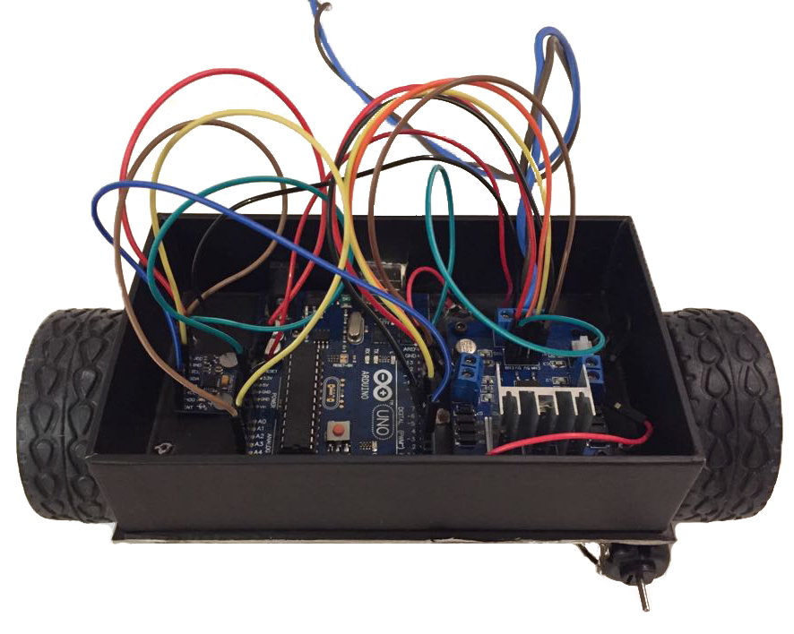

# Selbst-Balancierender Roboter

### Ziel

Ziel ist es einen Roboter mit 2-Rädern zu bauen, der von selbst gerade stehen kann in dem er sich ausbalanciert.

Mit einem Sensor soll der Roboter die Abneigung zur Senkrecht-Achse messen. Daraus folgend soll er die Motoren in die richtige Richtung stark genug antreiben.

### Bauteile

- Arduino Uno
- L298N Motor Driver Board Dual H-Bridge ([OEM](http://www.play-zone.ch/de/l298n-motor-driver-board-schrittmotor-treiber-modul-1550.html))
- MPU-6050 Gyroskop + Accelerometer ([Invensense](http://www.play-zone.ch/de/mpu-6050-accelerometer-gyro.html))
- 2 DC-Motoren (mit Getriebe)

### Schaltskizze

### Libraries 

- [PID](https://github.com/br3ttb/Arduino-PID-Library/)
- [I2Cdev](https://github.com/jrowberg/i2cdevlib)
- [MPU6050](https://github.com/jrowberg/i2cdevlib/tree/master/Arduino/MPU6050)
- Wire

### Arbeitsvorgang

1. [MPU-6050 Sensordaten ablesen](individual_files/mpu6050/MPU6050.md)
2. [Motoren ansteuern](individual_files/l298n/l298n.md)
3. [Steuerung von Motoren in Abhängigkeit der Neigung (PID)](individual_files/PID/PID.md)

### Fazit

[Kleines Video](graphics-diagramms/IMG_3839.mp4)

Das Projekt hatte sehr hohe Ansprüche. Schlussendlich sind wir mit der Realisation unseres Projekts zufrieden. Der Roboter balanciert zwar nicht stabil aber theoretisch haben wir alles richtig gemacht. Wir wissen noch nicht ob der Fehler technischer Natur ist oder aufgrund der Steuerung. 
Einerseits könnte das Problem daran liegen, dass unsere Motoren zu langsam reagieren, da bei jedem Richtungswechsel die Trägheit überwunden werden muss.  
Andernseits  könnte es daran liegen, dass wir einfach noch nicht die richtigen Parameter für den PID-Controller gefunden haben.
Schlussendlich ist es auch möglich, dass der niedrige Aufbau das Problem ist. Die Motoren müssen nämlich innerhalb von wenigen Milisekunden unter den fallenden Überbau fahren, was vielleicht zu schnell ist.

Das Schöne an diesem Projekt für uns ist eigentlich die lehrreiche Erfahrung. Wir haben sehr viel gelernt über einzelne Bauteile bis zu wie man ein solches Elektronik-Projekt angeht und wo eventuell Schwierigkeiten auftreten können.