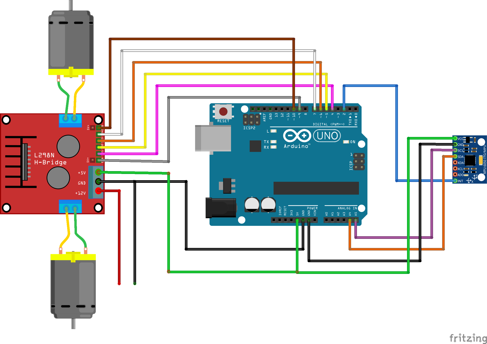

# Selbst-Balancierender Roboter

### Ziel

Ziel ist es einen Roboter mit 2-Rädern zu bauen, der von selbst gerade stehen kann in dem er sich ausbalanciert.

Mit einem Sensor soll der Roboter die Abneigung zur Senkrecht-Achse messen. Daraus folgend soll er die Motoren in die richtige Richtung stark genug antreiben.


### Bauteile

- Arduino Uno
- L298n H-Brücke
- MPU-6050 Gyroskop-Accelerometer
- 2 DC-Motoren

### Schaltskizze



### Libraries

- [PID](https://github.com/br3ttb/Arduino-PID-Library/)
- [I2Cdev](https://github.com/jrowberg/i2cdevlib)
- [MPU6050](https://github.com/jrowberg/i2cdevlib/tree/master/Arduino/MPU6050)
- Wire

### Arbeitsvorgang

1. [MPU-6050 Sensordaten ablesen](individual_test_files/mpu6050/MPU6050.md)
2. [Motoren ansteuern](individual_test_files/l298n/l298n.md)
3. Steuerung von Motoren in Abhängigkeit der Neigung

##### 3. Steurung in Abhängigkeit der Neigung

Es musste ein System entwickelt werden welches je nach Neigung des Roboters, die Motoren richtig ansteuerte. Dies erwies sich als ausserordentlich schwierig.
Wir haben allerdings eine Bibliothek gefunden die uns diese Aufgabe erleichtert: die PID Bibliothek.

Wikipedia: "Der [PID-Regler](https://de.wikipedia.org/wiki/Regler#PID-Regler) (proportional–integral–derivative controller) besteht aus den Anteilen des P-Gliedes, des I-Gliedes und des D-Gliedes."
Man muss dem Regler lediglich einen Input vorschreiben und das gewünschte Resultat einstellen. Der Regler berechnet dann den Weg der minimalen Abweichung.

Die Anpassungsparameter sind Kp, Ki & Kd.

```c
#include <PID_v1.h>

//Variablen und Parameter definieren
double pid_output = 0.0;
double pid_input = 255; // Neigung gegenüber Senkrecht-Achse
double setpoint = 255;
double Kp = 10;   //Schwankstärke
double Kd = 2; // beruhigen
double Ki = 0; // beruhigen

//Specify the links and initial tuning parameters
PID pid(&pid_input, &pid_output, &setpoint, Kp, Ki, Kd, DIRECT);

void setup()
{
  //anschalten
  pid.SetMode(AUTOMATIC);
  
  //Alle 10ms neuberechnen
  pid.SetSampleTime(10);
}

void loop()
{
  pid.Compute();
}
```

Der Regler schreibt automatisch in den pid_output. In unserem Programm bezeichnetein pid_input von 255 eine Neigung von 0° gegenüber der Senkrechtachse und ein pid_input von 0 einen +-90° Winkel. Die Richtung der Motoren wird separat manuell berechnet.
