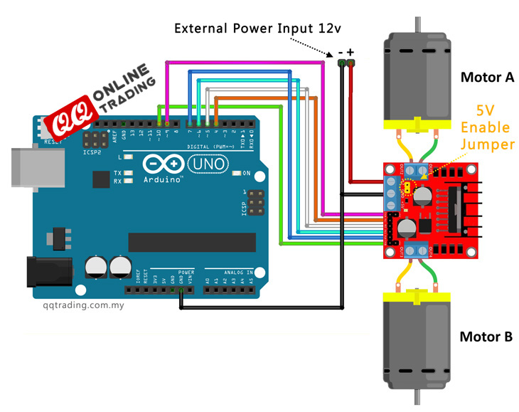

## L298n H-Brücke

Der zweite Schritt bestand darin die Motoren mit der H-Brücke zu verkabeln und diese zur externen Stomquelle und zum Arduino. Das Wissen dazu haben wir aus diesen beiden Tutorials erlernt: [Dronebotworkshop](http://dronebotworkshop.com/dc-motors-l298n-h-bridge/), [QQtrading](http://qqtrading.com.my/stepper-motor-driver-module-L298N).



```C
// Program: Control 2 DC motors using L298N H Bridge http://qqtrading.com.my/stepper-motor-driver-module-L298N

// Definitions Arduino pins connected to input H Bridge
int IN1 = 4;
int IN2 = 5;
int ENA = 9; // Needs to be a PWM pin to be able to control motor speed

int IN3 = 6;
int IN4 = 7;
int ENB = 10; // Needs to be a PWM pin to be able to control motor speed


void setup()
{
 // Set the output pins
 pinMode(IN1, OUTPUT);
 pinMode(IN2, OUTPUT);
 pinMode(IN3, OUTPUT);
 pinMode(IN4, OUTPUT);
 pinMode(ENA,OUTPUT);
 pinMode(ENB,OUTPUT);
}

void loop() {
 analogWrite(ENA, 100); // Sets speed variable via PWM
 analogWrite(ENB, 100); // Sets speed variable via PWM

 // Motor A vorwärts
 digitalWrite(IN1, HIGH);
 digitalWrite(IN2, LOW);
 delay(2000);
 // Motor A rückwärts
 digitalWrite(IN1, LOW);
 digitalWrite(IN2, HIGH);
 delay(2000);
 // Motor A anhalten
 digitalWrite(IN1, HIGH);
 digitalWrite(IN2, HIGH);
 delay(2000);

 // Motor B vorwärts
 digitalWrite(IN1, HIGH);
 digitalWrite(IN2, LOW);
 delay(2000);
}

```

Die Motoren lassen sich je über 3 Pins ansteuern. Für den Motor A sind die pins IN1, IN2 sowie ENA. Für den Motor B die pins IN3, IN4 und ENB. Die IN Pins kontrollieren analog die Richtung des Stroms.

| IN1  | IN2  | Motorbewegung |
| ---- | ---- | ------------- |
| LOW  | LOW  | nichts        |
| HIGH | LOW  | vorwärts      |
| LOW  | HIGH | rückwärts     |
| HIGH | HIGH | festhalten    |

Die EN Pins kontrollieren die Spannung über PWM und somit die Geschwindigkeit des jeweiligen Motoren.

### Stromzufuhr

Eine Schwierigkeit bestand darin wie man den Strom zuführen sollte. Wir wollten nämlich auf zwei verschiedene Stromquellen verzichten. Schlussendlich haben wir uns entschieden den Arduino über die H-Brücke zu füttern und diese über ein 12V Netzkabel. Die H-Brücke besitzt nämlich einen 5V-Regulator. Das einzige Risiko dabei war, dass die Motoren eventuell zu viel elektrischen Lärm machen würden. Dies hat sich aber nicht bestätigt.